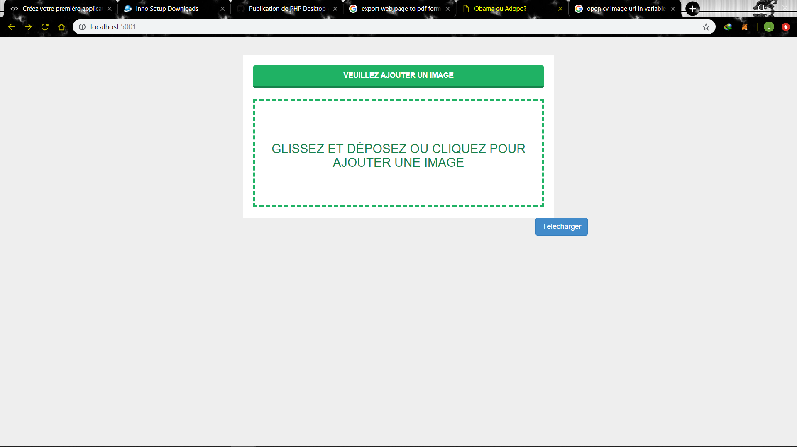
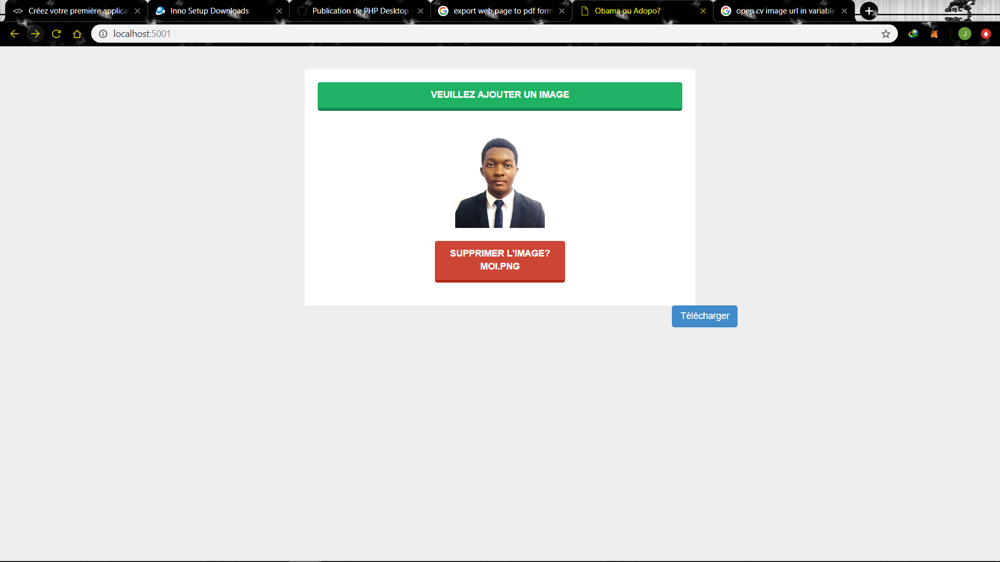
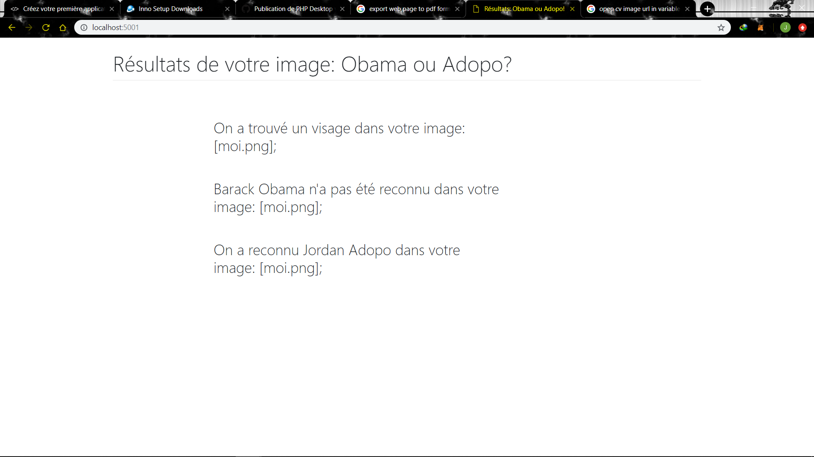

# face_recognition_web
It's a demo of face recognition using IA, opencv2, Flask.
In this example, i used face_encoding from face_recognition library to get face points of me and Barack Obama
After that, when you run, you will upload your image which will be compared with these two preloaded images...

# Before starting

install python 3.5.X
-------------------------------
https://www.python.org/downloads/

Install Visual Studio Community Edition
----------------------------------------------------------------
https://www.visualstudio.com/downloads/

Install Pillow
---------------------
easy_install Pillow

Install CMake
----------------------
python -m pip install --upgrade pip
pip install CMake

Install Face Recognition API
---------------------------------------------
pip install face_recognition

Install OpenCV
------------------------
pip install opencv-python

Install Flask
--------------------
pip install flask

<h2>Run
</h2>

  Tape in command prompt: <strong>python web_service_example.py </strong>.

 

  And after that, open your browser, tape: <strong>http://localhost:5001/ </strong>.

 

  

 

  

 

  

 
